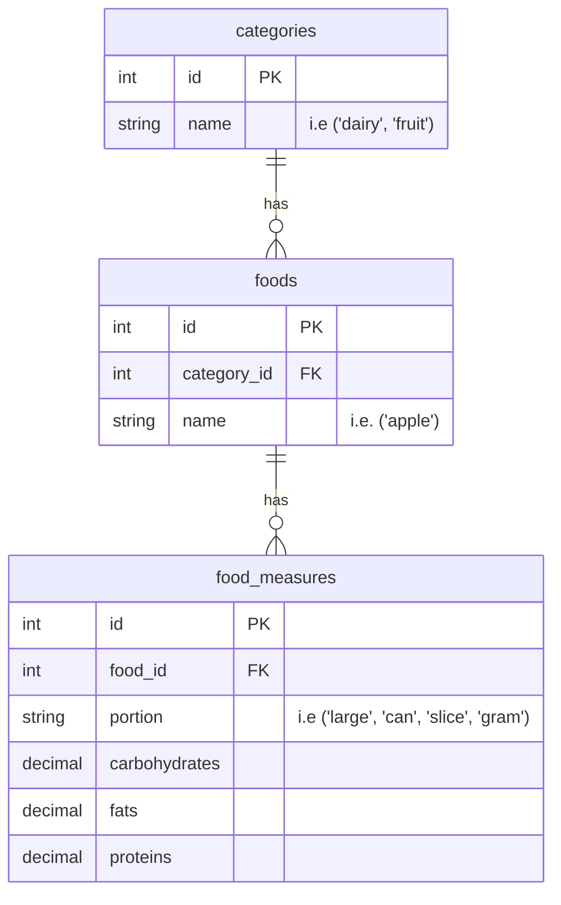
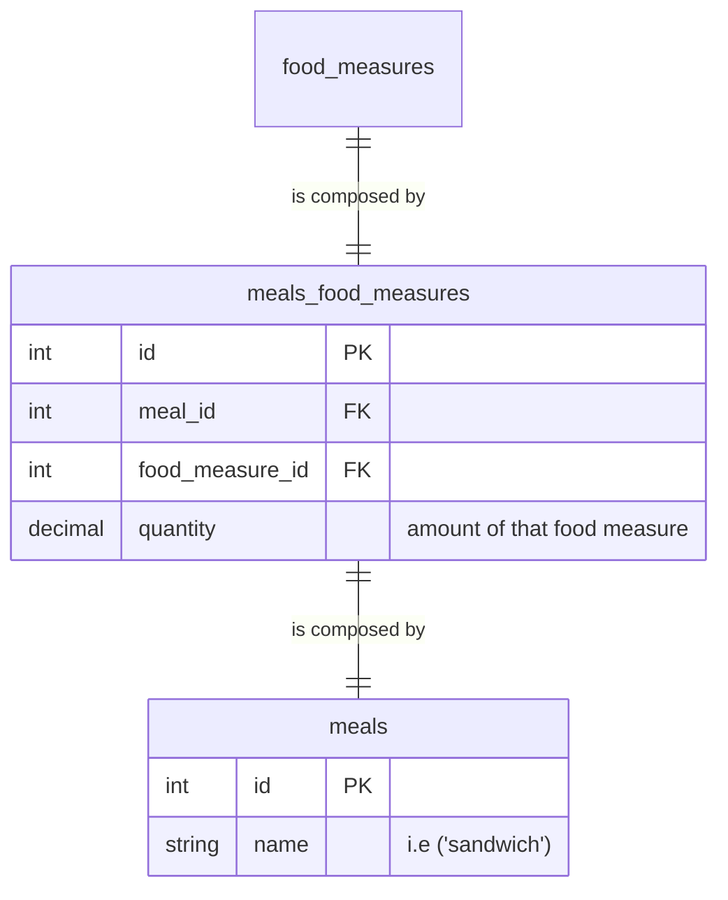

# Introduction

## Food

We store foods in the table `foods` and we don't relate them directly with its `carbohydrates`, `fats` and `proteins` because we want to be able of create foods easily by just know what the foods labels has, sometimes commercial foods are just labeled with fixed amounts as `2 slices`, `1 portion`, `1 can`, etc... so having it decoupled we can classify the main food in their own category what is it, if is `meat`, `fruit`, `vegetable` or `dairy`.

At the end we have tables like this:

In this way we can calculate the total calories of combination of foods to create meals and for making the shopping list we also know which category belongs each food.

## Meals

A meal is just a combination of foods, but in this case is going to be related with a food measure to know the total that we need of each either to count the calories or create the shopping list.

## Diets
