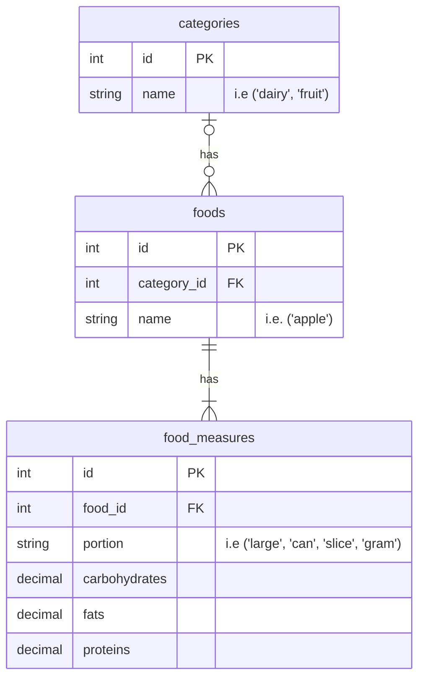
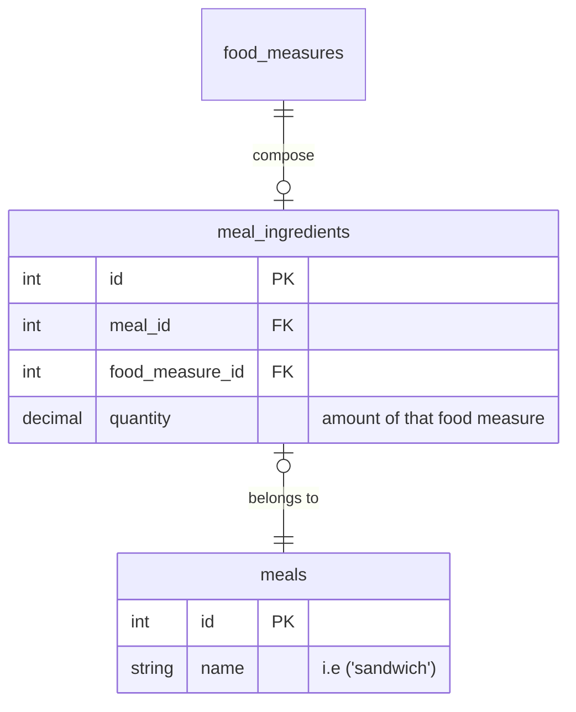
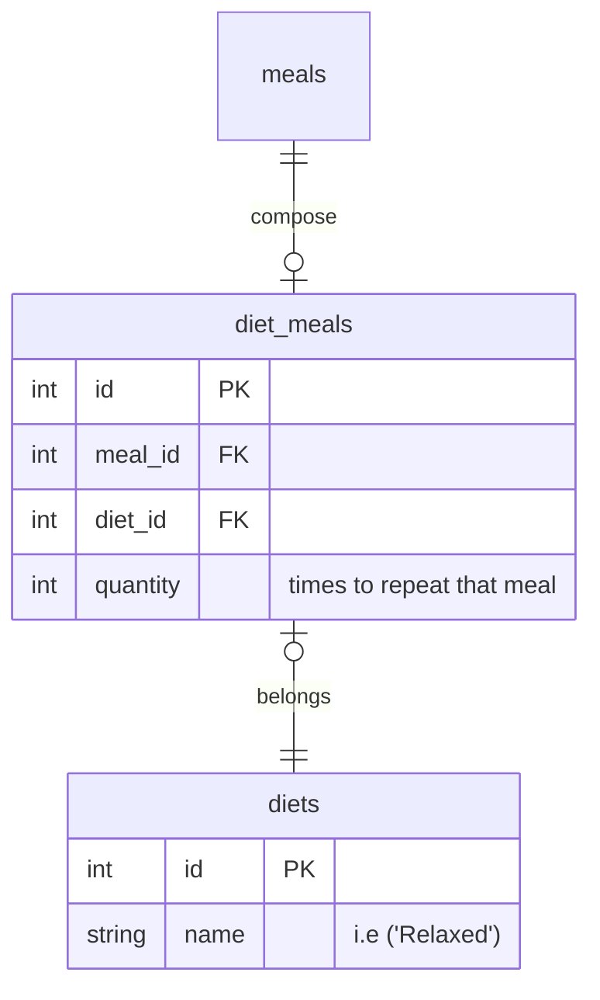

# Introduction

Main relations aiming to register diets in this system, as you can see is simple you can add many meals as you want in the week, just needing to be sure about how much calories you are to consume along the period of time that you determine.

## Food

We store foods in the table `foods` and we don't relate them directly with its `carbohydrates`, `fats` and `proteins` because we want to be able of create foods easily by just know what the foods labels has, sometimes commercial foods are just labeled with fixed amounts as `2 slices`, `1 portion`, `1 can`, etc... so having it decoupled we can classify the main food in their own category what is it, if is `meat`, `fruit`, `vegetable` or `dairy`.

At the end we have tables like this:

In this way we can calculate the total calories of combination of foods to create meals and for making the shopping list we also know which category belongs each food.

## Meals

A meal is just a combination of foods, but in this case is going to be related with a food measure to know the total that we need of each either to count the calories or create the shopping list.

## Diets

At the end we have a `diets` schema/table where we are going to store a meals combination to create a whole diet, we can repeat each meal different times, in order to achieve that we need to support that configuration.

With this approach we can create diets composed with different amount of meals in this way we can know how many meals and foods compose the diet and print the shopping list.

